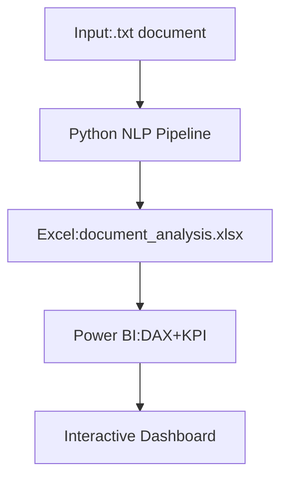
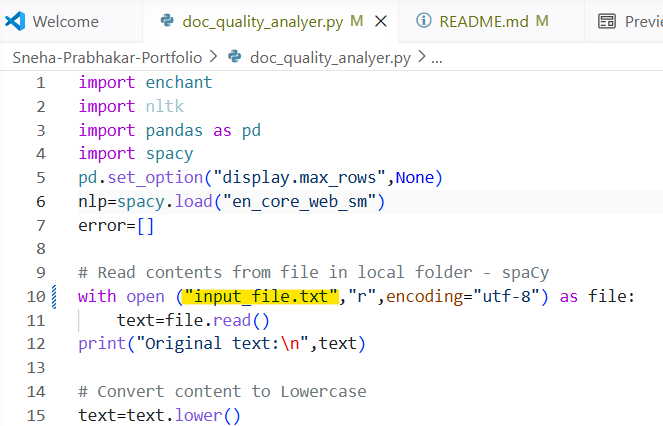
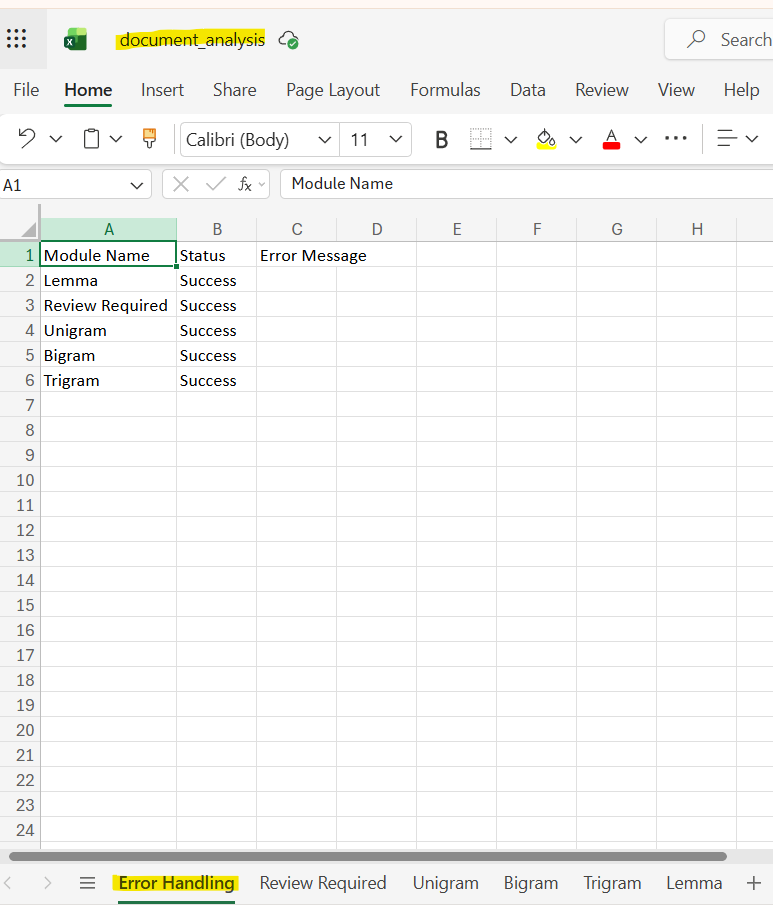
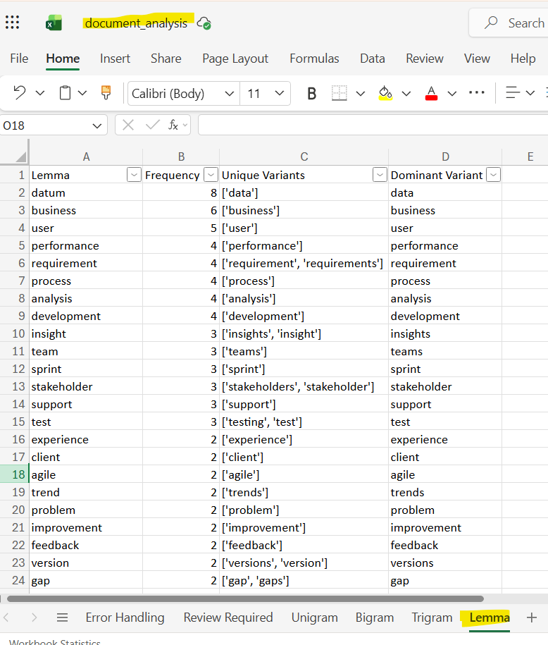
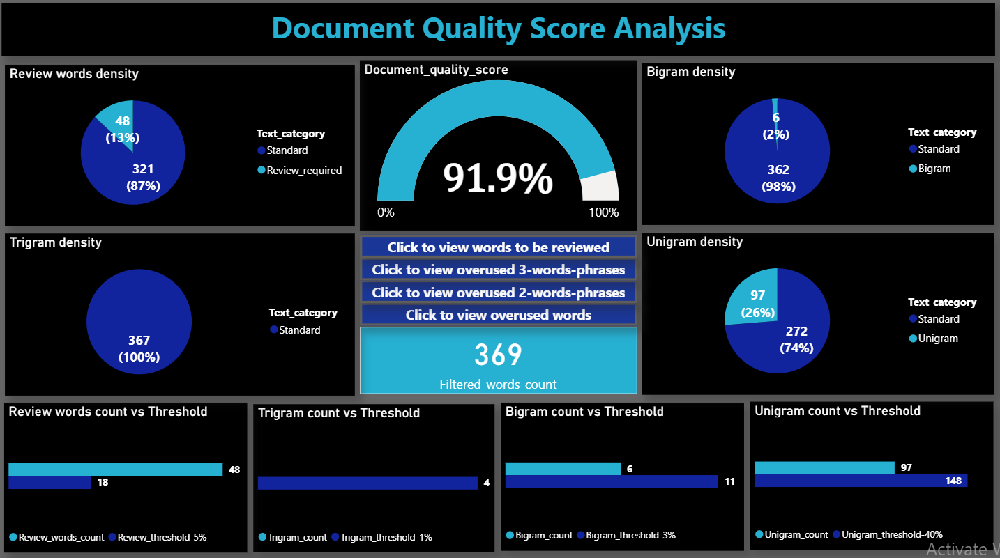
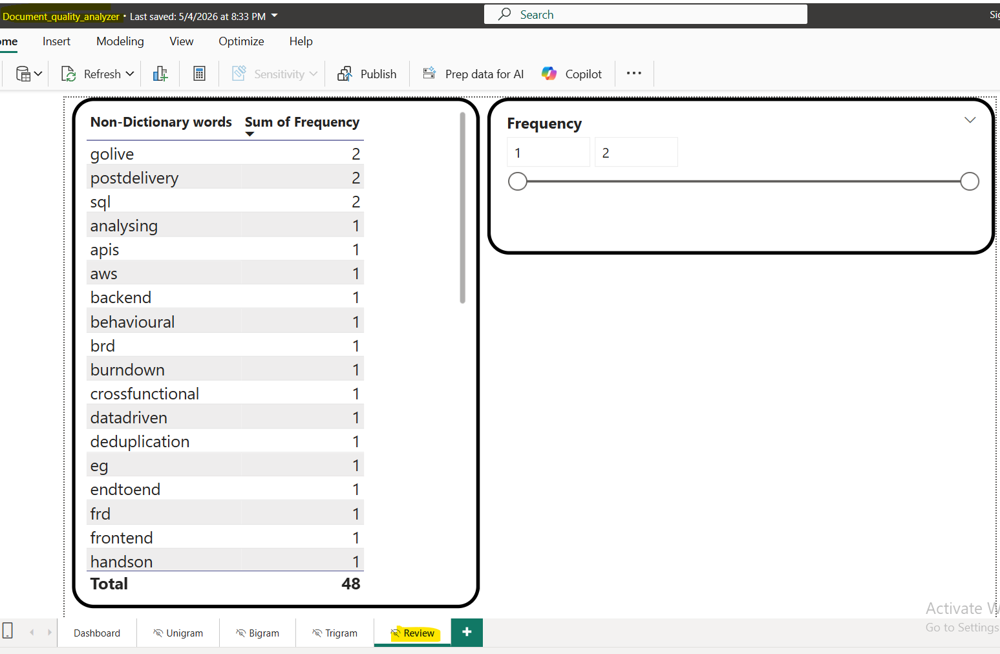
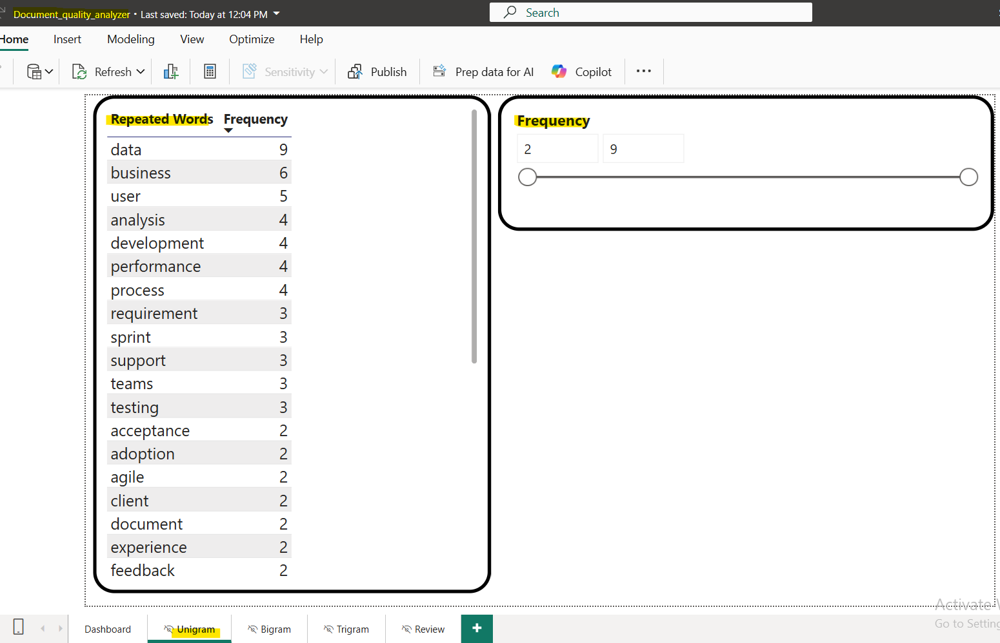
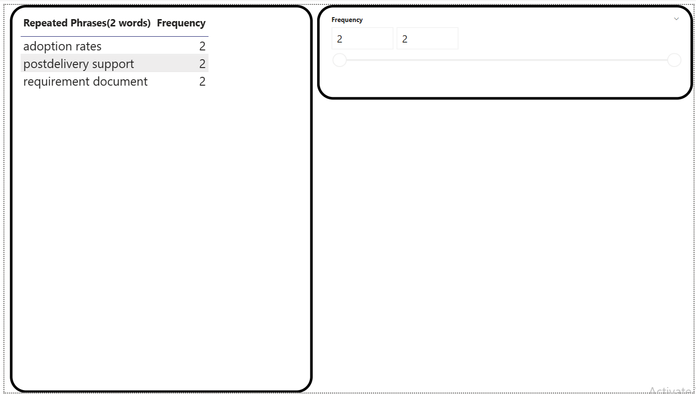
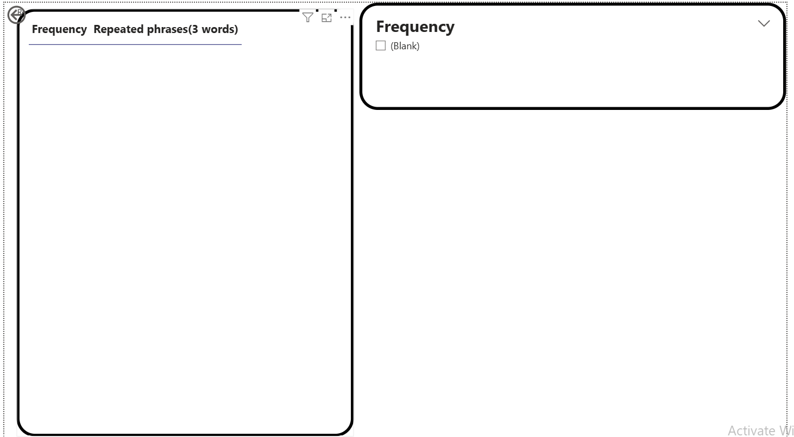

# NLP-based Document Quality Analyzer Pipeline
      

## TL;DR:
Automated NLP pipeline that scores business document quality on a 0-100 scale by detecting repetition and non-standard language  
**Impact**:  
- ~**60% faster** BRD/FRD/SRS/SOP review cycles vs manual process
- **100-point DQS KPI** tested on 50+ real business documents
- **5 empirically calibrated thresholds** for repetition + non-standard language  

**Tech Stack**:  
- **Python- NLP, NLTK, Pandas, spaCy, enchant, openpyxl**  
- **Power BI- DAX, Dashboard**   
## Business Problem
Business documents are often created and updated over long periods, increasing the likelihood of repetitive content and inconsistent terminology like shorthand/jargons/abbreviations which may not be universally understood by all stakeholders.  
So, this project aims to help user/team to assess the quality of a document on a scale of 0 to 100, based on repetitions of words/phrases and standard language format. The system highlights repetitive and non-standard terminology for review saving significant time in optimizing the document.
## System Architecture Diagram

## Features
- Text **Normalization** using **spaCy Lemmatization**
- **Unigram, Bigram, Trigram** frequency analysis
- Review-required word detection using **pyenchant**
- Empirically defined **Thresholds** from testing on real world business documents
- Dynamic threshold-based filtering using **DAX**
- **KPI**-driven document quality scoring 
- **Excel-based multi-sheet export** using **Openpyxl**
- **Interactive** Power BI **dashboard**
- Execution status/error **logging** 
## Project Structure 
Sneha-Prabhakar-Portfolio/   
    ├── doc_quality_analyzer.py    
    ├── requirements.txt    
    ├── input_file.txt  
    ├── document_analysis.xlsx  
    ├── Document_quality_analyzer.pbix  
    ├── Images  
    ├── watcher.py  
    ├── LICENSE  
    └── README.md   
## Dependencies
1. Python interpreter 3.12+ (Data Processing and Excel Export)    
    1.1. Environment setup- Python libraries- Install all necessary libraries using the command `pip install -r requirements.txt`    
    1.2. Model Loading: Download the spaCy English NLP model using the command `py -m spacy download en_core_web_sm`
2. Power BI (All Document Quality Score calculations and Interactive Report)  
## Skills demonstrated
**Data Processing**: Python- Pandas, NLTK, NLP, spaCy, Enchant, Openpyxl  
- Data **Normalization**: lowercasing, tokenization, stop-word filtering, punctuation removal, lemmatization   
- Data Structuring: Load results to DataFrames  
- Data Serialization: Export DataFrames to Excel for BI tools  
- **ETL**: Extract from .txt - Transform with NLP - Load to Excel for Power BI

**Data Analysis, BI & Visualization**: Power BI - **DAX**, **KPI** design, **Dashboarding**  
**Agile**: **End-to-end SDLC** execution   
**Software Design**: Modular **pipeline, Error handling, Logging**  
**Testing & Validation**: Iterative testing on 50+ documents  
**Business Analysis**: BRD/FRD/SRS/SOP domain knowledge, requirements quality
## Execution
1. Input: Copy the contents of your document into the file named `input_file.txt`
2. Data Processing: Run `doc_quality_analyzer.py`
3. Output: A structured output excel file `document_analysis.xlsx` will get generated in the same folder
4. KPI calculation & Visualization: Refresh the `Document_quality_analyzer.pbix` file to see the updated `Document Quality Score` **KPI** and other **metrics** with respect to the **thresholds**.    
## Visual Walkthrough
The following screenshots illustrate the end-to-end workflow of the pipeline
## `Input file location which stores the document content to be reviewed:`

## `Output Excel file:`

## `Lemmatization output:`

## `Interactive Dashboard:`

## `Words requiring review:` 

## `Frequently repeated words:`

## `Frequently repeated 2-words phrases:`

## `Frequently repeated 3-words phrases:`

## KPI, Metrics, Thresholds
Consistency in metrics is critical for fair comparison. 
Thresholds are empirically defined based on document length by testing the tool on 50+ different business documents and calibrated the percentage empirically based on observed output quality.  
### DAX Expressions for Metrics:
>Filtered_words_count = SUM(Lemma[Frequency])

>Review_threshold-5% = [Filtered_words_count]*5/100  
>Review_words_count = SUM('Review Required'[Frequency])  
>Review_words_density = DIVIDE([Review_words_count],[Filtered_words_count],0)  
>Review_vs_Standard = SWITCH(SELECTEDVALUE('Review_Density'[Text_category]),"Review_required",[Review_words_count],"Standard",[Filtered_words_count]-[Review_words_count])

>Unigram_threshold-40% = [Filtered_words_count]*40/100  
>Unigram_count = SUM(Unigram[Frequency])  
>Unigram_density = SUM(Unigram[Frequency])/[Filtered_words_count]  
>Unigram_vs_standard = SWITCH(SELECTEDVALUE('Unigram_density'[Text_category]),"Unigram",[Unigram_count],"Standard",[Filtered_words_count]-[Unigram_count])

>Bigram_threshold-3% = [Filtered_words_count]*3/100  
>Bigram_count = SUM(Bigram[Frequency])  
>Bigram_density = SUM(Bigram[Frequency])/([Filtered_words_count]-1)  
>Bigram_vs_Standard = SWITCH(SELECTEDVALUE('Bigram_Density'[Text_category]),"Bigram",[Bigram_count],"Standard",[Filtered_words_count]-1-[Bigram_count])

>Trigram_threshold-1% = [Filtered_words_count]*1/100  
>Trigram_count = SUM(Trigram[Frequency])  
>Trigram_density = SUM(Trigram[Frequency])/([Filtered_words_count]-2)  
>Trigram_vs_Standard = SWITCH(SELECTEDVALUE('Trigram_Density'[Text_category]),"Trigram",[Trigram_count],"Standard",[Filtered_words_count]-2-[Trigram_count])

>`Phrase_density_threshold = (1/100*60/100)+(3/100*30/100)+(40/100*10/100)`  
>`Phrase_density = (Trigram[Trigram_density]*0.6)+(Bigram[Bigram_density]*0.3)+(Unigram[Unigram_density]*0.1)`
Note: 60/30/10 split in weightage - Phrase_density is a weighted composite score here trigrams(3-words phrases) contribute to 60% due to their strong impact on readability, bigrams(2-words phrases) 30% for moderate repetition patterns, and unigrams(single words) 10% since it is unavoidable. This weightage is defined based on testing the metrics on 50+ real world business documents.  
### KPI - DAX expressions:
>`Quality_deviation_index = ('Review Required'[Review_words]*0.5)+([Phrase_density]*0.5)`  
>`Document_quality_score = 100-[Quality_deviation_index]`  
DQS=100-QDI  

Note 1: QDI(Quality_deviation_index) balances two equal factors: 50% weight on non-standard terminologies requiring review and 50% on phrase repetition density. This ensures the final DQS penalizes both unclear language and excessive repetition equally   
Note 2: The above formulas Review_words_density, Unigram_density, Bigram_density, Trigram_density, Quality_deviation_index and Document_quality_score are percentage values (0-100 scale)
## Testing
Tested using both AI generated synthetic documents and publicly available business analysis documents like BRDs, FRDs, SRS and SOPs  
## Usage
Used by BAs and PMs to pre-check BRDs, FRDs, SRS, and SOPs before stakeholder review. Flags jargon and repetitive language to improve document quality and reduce review cycles.  
## Challenges
### 1. Choosing the optimal tool
i. Initially **multiple NLP techniques** such as Porter stemming, Noun chunks, YAKE, RAKE, Key BERT and TF-IDF were evaluated for keyword extraction and text analysis. However, the output retained several **inconsistent word forms and reduced linguistic consistency**. To improve normalization and standardize textual analysis, **spaCy library-based Lemmatization** was adopted.  
ii. Observed **suboptimal lemmatization** accuracy when stopword removal was performed before spaCy lemmatization, leading to a **change in preprocessing order**(stop words removal after lemmatization).  
iii. For **improved downstream n-gram analysis** accuracy, switched to **Enchant dictionary from the NLTK** words corpus, since **verb forms** other than present verbs and plural nouns were **incorrectly identified** as non-standard American English words(American spelling style is followed for this analysis).  
### 2. Exception Handling
Error in a block of code leading to **further code blocks execution halt**; Handled this using **'try-except'** blocks and **execution status logging** for each processing stage.  
## Advantages
1. **Context-aware analysis**: The nouns, adjectives and verbs(multiple verb forms) are treated differently based on the context
2. **Calibrated, not arbitrary thresholds**: Frequency thresholds were empirically derived by testing across 50+ real business documents, making the quality scoring reflective of actual document patterns rather than assumptions
3. **Architectural separation of concerns**: Raw text extraction and NLP processing are handled in Python, while all scoring and KPI calculations are performed in Power BI using DAX - keeping each layer optimized for what it does best
## Limitation
Currently supports plain text (.txt) input format only; so copy-paste contents from word or pdf document into the input file
## Future Enhancements
1. Extension to **additional formats** such as .docx, .pdf and .doc parsing
2. **Automatic dashboard report update** on Input file change - Watchdog Python script on file content change or Embed Python script directly inside Power BI's 'Power Query'(On clicking Refresh in dashboard)  
3. Maintain a **custom technical dictionary for domain terminologies**, which are not in the standard language dictionary, for better refinement in 'Review Required' words list.  
## Help
To change the language model for analysing the document, change the "en_US" in the line of code `d=enchant.Dict("en_US")` to the preferred language model, say "en_GB" for British English language model.  
## Contributing
Feel free to submit pull requests or open issues.  
## License
This project is licensed under the [MIT License](LICENSE)
## Contact
Email: jesussnehaprabhakar@gmail.com  
LinkedIn: www.linkedin.com/in/sneha-prabhakar-664821184  
